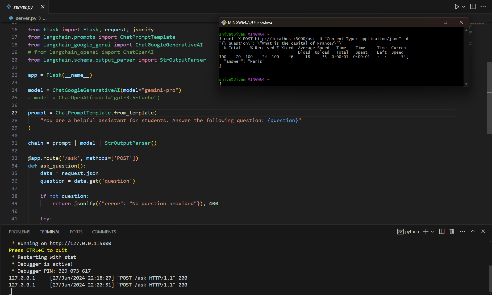

# LangChain Flask API



This project is a simple Flask API server that uses the LangChain pipeline to answer questions. The server listens for POST requests to the `/ask` endpoint with a JSON payload containing a question. It then uses the LangChain pipeline to generate an answer to the question and returns it in the response.

## Requirements

- Python 3.7+
- Flask
- LangChain
- Google Generative AI API key (or OpenAI API key if using the OpenAI model)

## Installation

1. Clone this repository:
   ```
   git clone https://github.com/yourusername/langchain-flask-api.git
   cd langchain-flask-api
   ```

2. Create a virtual environment (optional but recommended):
   ```
   python -m venv venv
   source venv/bin/activate  # On Windows, use `venv\Scripts\activate`
   ```

3. Install the required packages:
   ```
   pip install flask langchain langchain-google-genai
   ```
   If using OpenAI instead of Google AI, also install:
   ```
   pip install langchain-openai
   ```

## Setting up API Keys

### For Google Generative AI

1. Obtain an API key from the [Google AI Studio](https://makersuite.google.com/app/apikey).
2. Set the environment variable:
   - On Windows:
     ```
     setx GOOGLE_API_KEY your_api_key_here
     ```
   - On Linux/macOS:
     ```
     export GOOGLE_API_KEY=your_api_key_here
     ```

### For OpenAI (if using)

1. Obtain an API key from [OpenAI](https://platform.openai.com/account/api-keys).
2. Set the environment variable:
   - On Windows:
     ```
     setx OPENAI_API_KEY your_api_key_here
     ```
   - On Linux/macOS:
     ```
     export OPENAI_API_KEY=your_api_key_here
     ```

## Running the Server

### Using Python

Run the following command:
```
python server.py
```

### Run Using a Batch File (Windows)

Double-click `run_server.bat` to start the server.

## Testing the Server

You can test the server using cURL:

```
curl -X POST http://localhost:5000/ask -H "Content-Type: application/json" -d "{\"question\": \"What is the capital of France?\"}"
```

Or using Python:

```python
import requests

response = requests.post('http://localhost:5000/ask', json={'question': 'What is the capital of France?'})
print(response.json())
```

## Configuration

The server uses the Google Generative AI "gemini-pro" model by default. If you want to use OpenAI's model instead:

1. Uncomment the OpenAI import and model initialization in `server.py`.
2. Comment out the Google AI import and model initialization.

## License

This project is licensed under the MIT License.